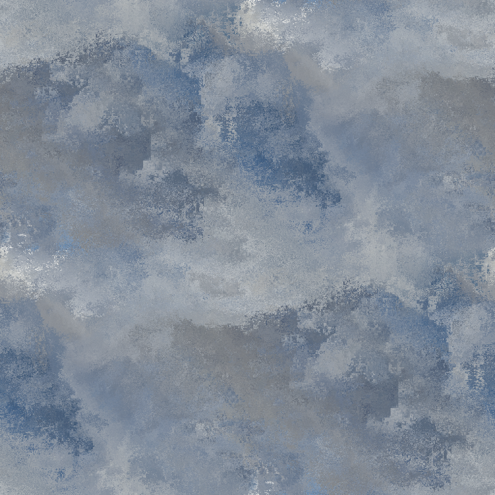
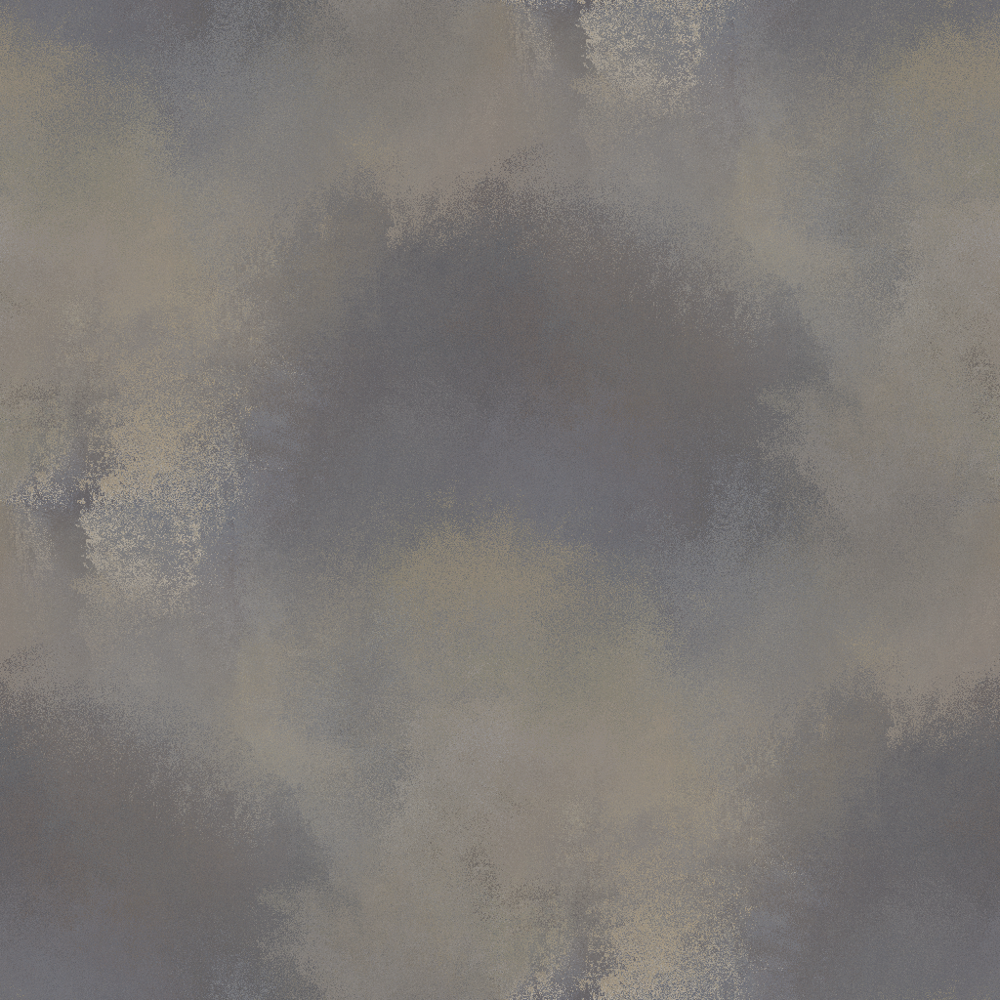
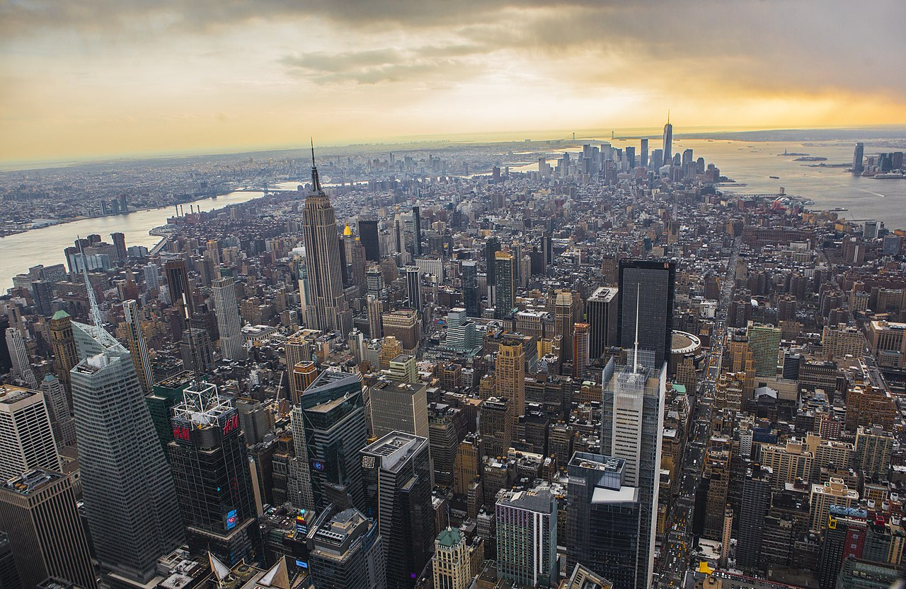
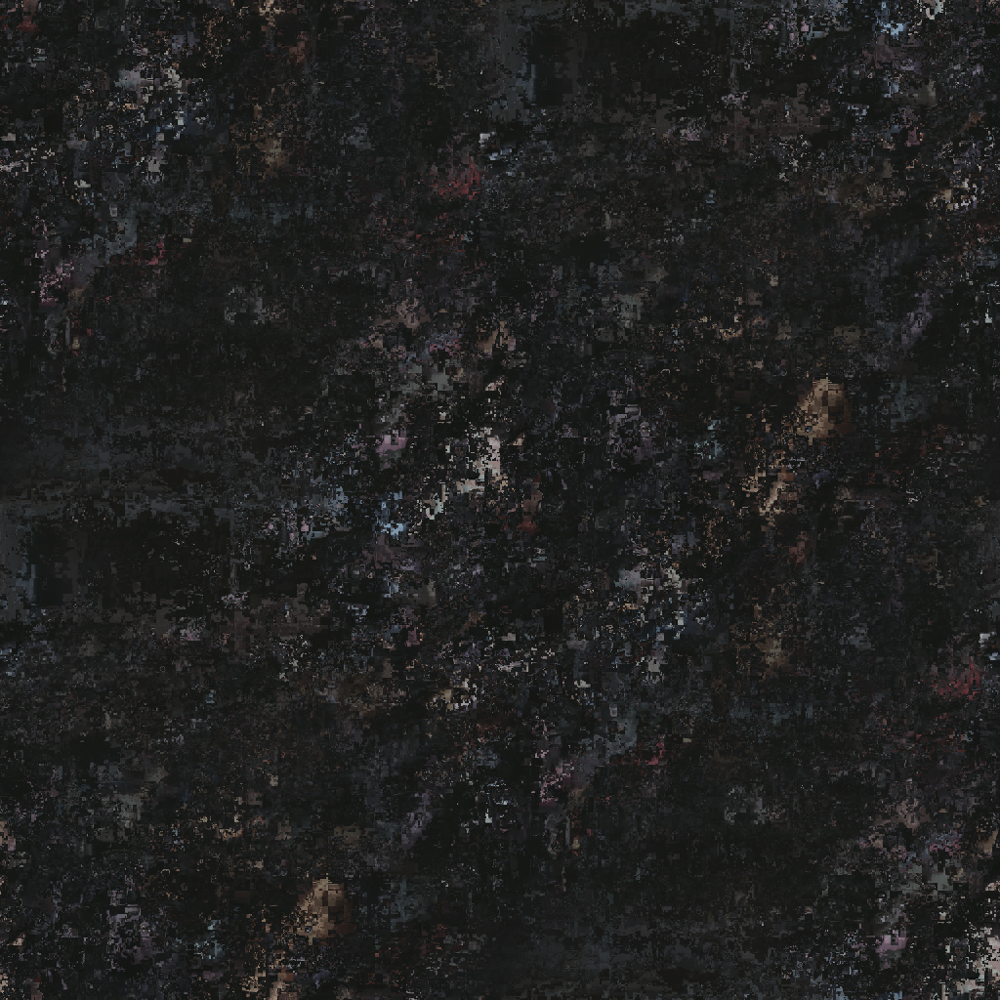
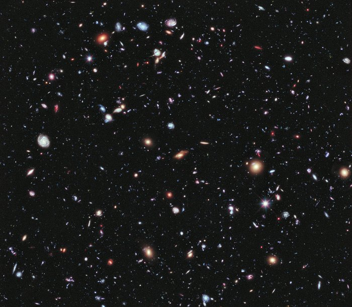

# open-camouflages

- Open camouflages.
- A set of camouflage artistic design.
- Used for fictions and game development.
- Completely FICTIONAL.
- NOT AFFILIATED with ANY of the real-world camouflages.
- Does NOT RESEMBLE ANY of the real-world camouflages.

# Copyright

## Textual and Code Contents

```
Copyright (C) 2024 Yucheng Liu. Under the AGPL 3.0 License.
AGPL 3.0 License: https://www.gnu.org/licenses/agpl-3.0.txt .
```

- [The AGPL 3.0 License.](./license)

## Non-textual or Non-code Contents

```
Copyright (C) 2024 Yucheng Liu. Under the CC 4.0 BY-SA License.
CC 4.0 BY-SA License: https://creativecommons.org/licenses/by-sa/4.0/legalcode.txt .
```

- [The CC 4.0 BY-SA License.](./license-2)

# Image Manipulation Tools

- [GIMP](https://www.gimp.org/downloads/) for pixel images.
- [Inkscape](https://inkscape.org/release/inkscape-1.3.2/) for vector images.

# Camouflages

## Mount Everest

- Camouflage.



- Based on photograph.


- Attributing the photograph author.

```
By I, Luca Galuzzi, CC BY-SA 2.5,
Link: https://commons.wikimedia.org/w/index.php?curid=1810976 .
```

## Manhattan

- Camouflage.



- Based on photograph.



- Attributing the photograph author.

```
By Quintano, Anthony, CC BY 2.0,
Link: https://en.wikipedia.org/wiki/File:Above_Gotham.jpg .
```

## Hubble eXtreme Deep Field

- Camouflage.



- Based on photograph.



- Attributing the photograph author.

```
By ESA/Hubble, CC BY 4.0,
Link: https://esahubble.org/images/heic1214a/ .
```
